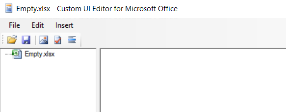
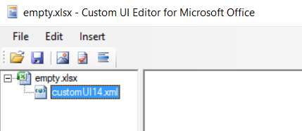
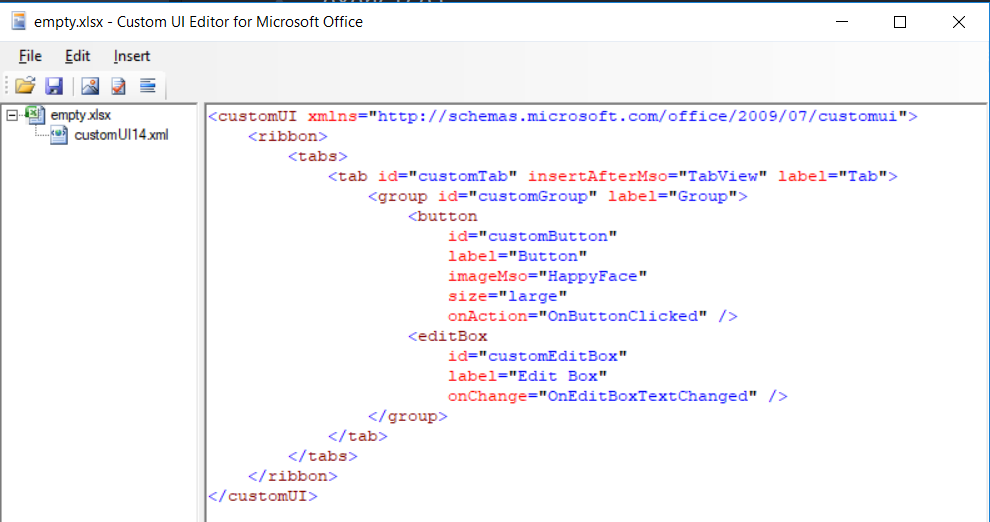
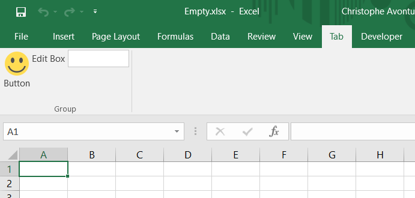
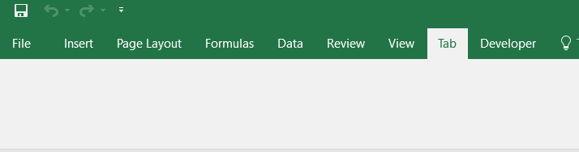
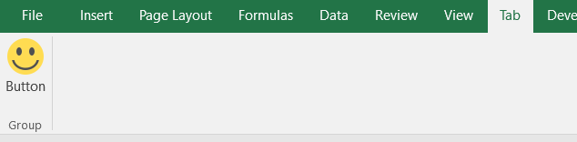

# Add a ribbon in MS Office

The CustomOfficeUIEditor tool isn't a user-friendly tool: you'll need to type yourself the XML of the ribbon. That XML is also called "the manifest file".

By default, a standard MS Office document doesn't contain any ribbon so, when you'll open such files with the CustomOfficeUIEditor tool, you'll get an empty document.

Here is a very small XML for creating a ribbon with a button and an edit box:

```xml
<customUI xmlns="http://schemas.microsoft.com/office/2009/07/customui">
    <ribbon>
        <tabs>
             <tab id="customTab" insertAfterMso="TabView" label="Tab">
                <group id="customGroup" label="Group">
                    <button
                        id="customButton"
                        label="Button"
                        imageMso="HappyFace"
                        size="large"
                        onAction="OnButtonClicked" />
                    <editBox
                        id="customEditBox"
                        label="Edit Box"
                        onChange="OnEditBoxTextChanged" />
                </group>
            </tab>
        </tabs>
    </ribbon>
</customUI>
```

## Add a ribbon

Once you've installed CustomOfficeUIEditor, just start the interface by double-clicking on the executable. You'll get a screen like this:


A very simplified interface where you'll click on the `File` option to open your document.

Open any existing Excel workbook (or just create an empty one for the exercice).

>**When using the editor, the file itself can't be opened in Excel! Imagine the following situation: the workbook is opened both in the editor and in Excel. You make a lot of changes in Excel, switch to the editor and change the manifest. By saving the file in the editor, you'll lose every change made in Excel so... be careful.**



The first time, you'll need to add a new ribbon: click on the `Insert` menu and select `Office 2010 Custom UI Part`.


You'll then obtain a screen like this:



When `customUI14.xml` is selected (like illustrated above), click in the right pane and start to code your XML content.



Before saving your file, be sure to click on the `Validate` button so a check is made to verify the quality of the content.

In the example here below, you can see that an error is displayed telling that an attribute `ID` (in uppercase) has been found and that this name isn't declared. Indeed, the correct spelling is `id` (in lowercase). *XML is a case-sensitive language and is terribly strict, no syntax errors will be tolerated*


When the ribbon is correct, save the file and open it in Excel. If everything goes fine, you'll obtain this:



## Manifest analysis

Time to understand what has happens...

### The root customUI node and the namespace

```xml
<customUI xmlns="http://schemas.microsoft.com/office/2009/07/customui">
```

The manifest is a XML content and should be valid. You'll need to define your content into a `<customUI>` node (mandatory) and you'll need to specify the `xmlns` (for `namespace`) attribute (mandatory).

The [namespace]{#namespace} file will define what attributes exists, are mandatory or not, for each node type. The referred URL is the `Document Type Definition` (aka *DTD*).

For instance, when the user will click on the button of your ribbon, you'll wish to be able to capture the click and start a subroutine that you've code in VBA. The "on click event" should be defined in the `onAction` attribute as defined in the DTD. *Microsoft maintain the documentation here: [https://msdn.microsoft.com/en-us/library/dd909370(v=office.12).aspx](https://msdn.microsoft.com/en-us/library/dd909370(v=office.12).aspx).*

So, if you know that the attribute is `onAction` you can then add your own subroutine by typing something like `onAction="OnButtonClicked"`.

The job of the DTD is to make sure that the syntax of your manifest is correct; therefore, the attribute `xmlns="http://schemas.microsoft.com/office/2009/07/customui"` is well mandatory.

#### Define the ribbon

The ribbon should define inside the `<ribbon>` node but not immediately since a ribbon is, in fact, always defined in a tab.

Below we can see the standard ribbon of Excel and you can see a lot of tabs: `File`, `Insert`, `Page layout`, `Formulas`, `Data`, `Review`, `View`, ...


Each tab comes with features (buttons, checkboxes, ...). For the `Insert` tab, we've first a group of three buttons into a group called `Tables`:


So, a ribbon should be:

1. Defined in a tab (his own tab or an existing one)
2. Add features in one or more groups (own groups or existing ones)

Below, our manifest now, with the definition of the ribbon. *Lines starting with a `+` are the ones we've added. The `+` sign is here only to put in evidence the lines; the sign is not valid so don't copy/paste in your ribbon.*

```diff
<customUI xmlns="http://schemas.microsoft.com/office/2009/07/customui">
+    <ribbon>
+        <tabs>
+             <tab id="customTab" insertAfterMso="TabView" label="Tab">
+                <group id="customGroup" label="Group">
+                    YOUR FEATURES HERE
+                </group>
+        </tabs>
+    </ribbon>
</customUI>
```

### Define the tab

You'll need to give an identifier to the tab (in the attribute called `id`): your own code for a new tab or the id of an existing tab.

The standard name are:

* `TabHome`
* `TabInsert`
* `TabPageLayoutExcel`
* `TabFormulas`
* `TabData`
* `TabReview`
* `TabView`
* `TabDeveloper`

So, if you want to add a button to the Home tab, just use `TabHome` as value for the `id`, f.i.,

```xml
<customUI xmlns="http://schemas.microsoft.com/office/2009/07/customui">
    <ribbon>
        <tabs>
             <tab id="TabHome">
                ADD A BUTTON TO TabHome
        </tabs>
    </ribbon>
</customUI>
```

The XML below will, in one line,

1. Create a new tab since the id `customTab` is not an existing id,
2. Put the new tab after the existing `View` tab (use `insertBeforeMso` to add the tab before),
3. And give him `Tab` as caption.

```xml
<tab id="customTab" insertAfterMso="TabView" label="Tab">
```

Here is our added tab:


#### Define the ribbon

Inside the `<tab>` declaration, you need to define at least one `<group>`. And here too, you'll to define the identifier: an existing one for, f.i., adding a button in an existing group or a new one to create a new group.

The XML below will:

1. Create a new group since the id is a new one (`customGroup`),
2. And give him `Group` as name.

```xml
<group id="customGroup" label="Group">
```

Our tab with his group:



As you can see here above, just adding a group isn't enough, you'll need to define which features (buttons, checkboxes, ...) should be added in the group.

### Add features

The XML here below will add to things: a button and an edit box.

*Lines starting with a `+` are the ones we've added. The `+` sign is here only to put in evidence the lines; the sign is not valid so don't copy/paste in your ribbon.*

```diff
<customUI xmlns="http://schemas.microsoft.com/office/2009/07/customui">
    <ribbon>
        <tabs>
             <tab id="customTab" insertAfterMso="TabView" label="Tab">
                <group id="customGroup" label="Group">
+                    <button
+                        id="customButton"
+                        label="Button"
+                        imageMso="HappyFace"
+                        size="large"
+                        onAction="OnButtonClicked" />
+                    <editBox
+                        id="customEditBox"
+                        label="Edit Box"
+                        onChange="OnEditBoxTextChanged" />
                </group>
        </tabs>
    </ribbon>
</customUI>
```

The XML below will create a button

1. With an `id` initialized to `customButton`,
2. His label (the text that is displayed under the button) set to `Button`,
3. Use the `HappyFace` standard image (`imageMso` is, indeed, the way to reuse a standard image while `image` allows you to define yours owns),
4. The size of the button will be `large` (a big button),
5. The action assigned will be the VBA function called `OnButtonClicked`.

```xml
<button
    id="customButton"
    label="Button"
    imageMso="HappyFace"
    size="large"
    onAction="OnButtonClicked" />
```

This will result into this:



`OnButtonClicked` is the VBA callback: to make it work, add a module in your Excel file, create a subroutine like this:

```vbnet
Public Sub OnButtonClicked
    Msgbox "You've clicked on the button", vbInformation
End Sub
```

And we can add other features, like an edit box:

```xml
<editBox
    id="customEditBox"
    label="Edit Box"
    onChange="OnEditBoxTextChanged" />
```


As you can see here above, the list of properties depends on the type: for a button, we've a `onAction` attribute while it's an `onChange` for an editBox.
