<!-- This file has been generated automatically by the following script -->
<!-- C:\Christophe\Repository\writing-documentation\concat-md\concat-md.ps1 -->
<!-- So don't modify this file manually but run the tool once more instead -->

<!-- Last refresh date: 2020-04-25 11:34:12 -->

<!-- below, content of ./index.md -->

# MS Office - How to create a ribbon in Excel

>This documentation will explain how to add / edit a custom ribbon in an Excel file


<!-- table-of-contents - start -->
* [Get the editor](#get-the-editor)
* [Add a ribbon in MS Office](#add-a-ribbon-in-ms-office)
    * [Add a ribbon](#add-a-ribbon)
    * [Manifest analysis](#manifest-analysis)
       * [The root customUI node and the namespace](#the-root-customui-node-and-the-namespace)
          * [Define the ribbon](#define-the-ribbon)
       * [Define the tab](#define-the-tab)
          * [Define the ribbon](#define-the-ribbon)
       * [Add features](#add-features)
* [Edit a ribbon](#edit-a-ribbon)
* [List of objects](#list-of-objects)
* [Find images](#find-images)
* [Assign callbacks](#assign-callbacks)
<!-- table-of-contents - end -->

<!-- below, content of ./010-get-editor/readme.md -->

## Get the editor

To be able to "easily" *(in a not WYSIWYG interface)* create a ribbon in MS Office, I'm using a very old tool called `CustomOfficeUIEditor`. *Until now, I've not found any other free tool for doing this.*

The tool can be downloaded from [http://openxmldeveloper.org/blog/b/openxmldeveloper/archive/2006/05/26/customuieditor.aspx](http://openxmldeveloper.org/blog/b/openxmldeveloper/archive/2006/05/26/customuieditor.aspx).

For this purpose, I've taken a copy of the software, which can be downloaded [here](./files/OfficeCustomUIEditorSetup.zip)

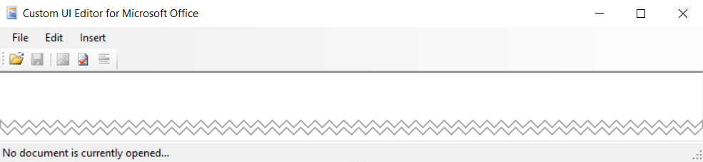

CustomOfficeUIEditor is an external tool (outside MS Office) who can open an Office file and add the needed files to create a ribbon. It's possible to do this without an editor, for instance by using a software like 7-Zip since a .xlsx / .xlsm file is an archive with files and folders.

<!-- below, content of ./020-add-ribbon/readme.md -->

## Add a ribbon in MS Office

The CustomOfficeUIEditor tool isn't a user-friendly tool: you'll need to type yourself the XML of the ribbon. That XML is also called "the manifest file".

By default, a standard MS Office document doesn't contain any ribbon so, when you'll open such files with the CustomOfficeUIEditor tool, you'll get an empty document.

Here is a very small XML for creating a ribbon with a button and an edit box:

```xml
<customUI xmlns="http://schemas.microsoft.com/office/2009/07/customui">
    <ribbon>
        <tabs>
             <tab id="customTab" insertAfterMso="TabView" label="Tab">
                <group id="customGroup" label="Group">
                    <button
                        id="customButton"
                        label="Button"
                        imageMso="HappyFace"
                        size="large"
                        onAction="OnButtonClicked" />
                    <editBox
                        id="customEditBox"
                        label="Edit Box"
                        onChange="OnEditBoxTextChanged" />
                </group>
            </tab>
        </tabs>
    </ribbon>
</customUI>
```

### Add a ribbon

Once you've installed CustomOfficeUIEditor, just start the interface by double-clicking on the executable. You'll get a screen like this:


A very simplified interface where you'll click on the `File` option to open your document.

Open any existing Excel workbook (or just create an empty one for the exercice).

>**When using the editor, the file itself can't be opened in Excel! Imagine the following situation: the workbook is opened both in the editor and in Excel. You make a lot of changes in Excel, switch to the editor and change the manifest. By saving the file in the editor, you'll lose every change made in Excel so... be careful.**

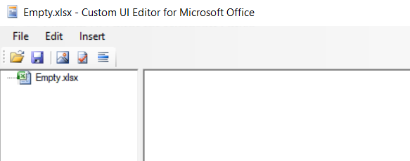

The first time, you'll need to add a new ribbon: click on the `Insert` menu and select `Office 2010 Custom UI Part`.

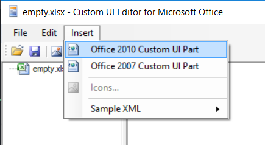

You'll then obtain a screen like this:


When `customUI14.xml` is selected (like illustrated above), click in the right pane and start to code your XML content.

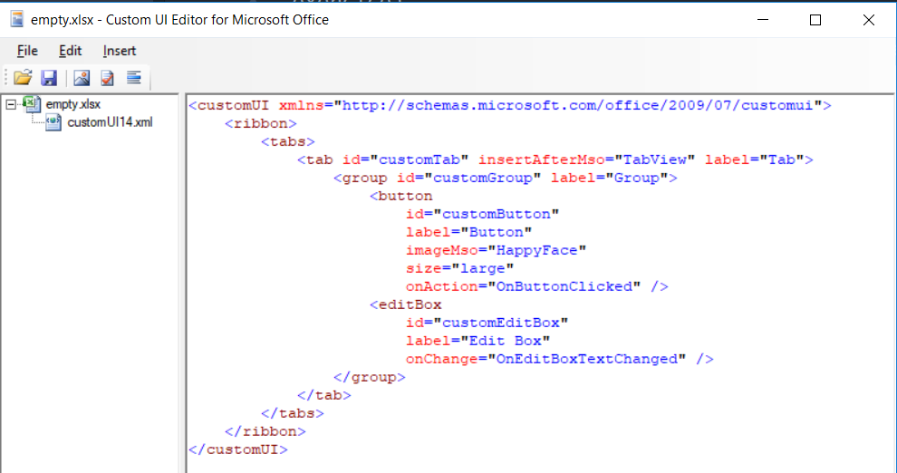

Before saving your file, be sure to click on the `Validate` button so a check is made to verify the quality of the content.

In the example here below, you can see that an error is displayed telling that an attribute `ID` (in uppercase) has been found and that this name isn't declared. Indeed, the correct spelling is `id` (in lowercase). *XML is a case-sensitive language and is terribly strict, no syntax errors will be tolerated*

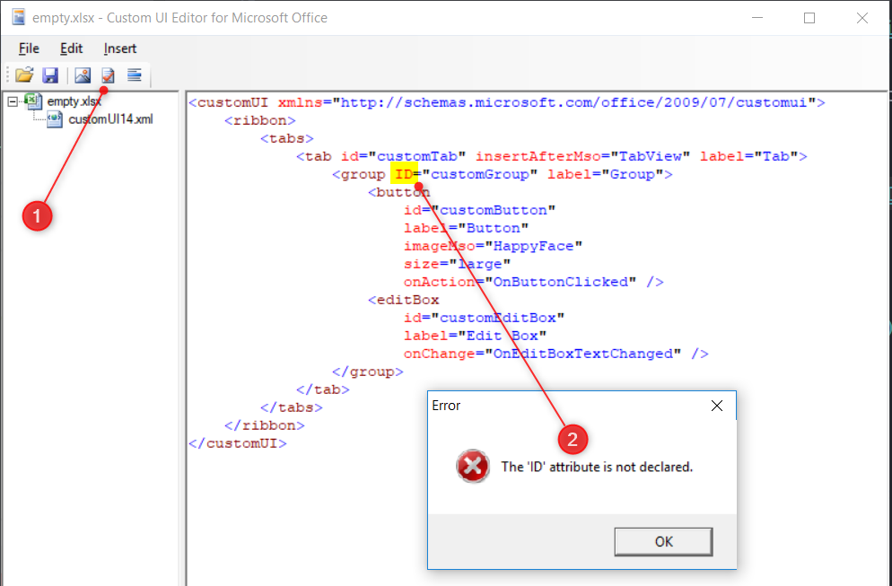

When the ribbon is correct, save the file and open it in Excel. If everything goes fine, you'll obtain this:

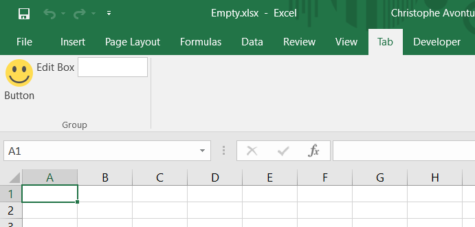

### Manifest analysis

Time to understand what has happens...

#### The root customUI node and the namespace

```xml
<customUI xmlns="http://schemas.microsoft.com/office/2009/07/customui">
```

The manifest is a XML content and should be valid. You'll need to define your content into a `<customUI>` node (mandatory) and you'll need to specify the `xmlns` (for `namespace`) attribute (mandatory).

The [namespace]{#namespace} file will define what attributes exists, are mandatory or not, for each node type. The referred URL is the `Document Type Definition` (aka *DTD*).

For instance, when the user will click on the button of your ribbon, you'll wish to be able to capture the click and start a subroutine that you've code in VBA. The "on click event" should be defined in the `onAction` attribute as defined in the DTD. *Microsoft maintain the documentation here: [https://msdn.microsoft.com/en-us/library/dd909370(v=office.12).aspx](https://msdn.microsoft.com/en-us/library/dd909370(v=office.12).aspx).*

So, if you know that the attribute is `onAction` you can then add your own subroutine by typing something like `onAction="OnButtonClicked"`.

The job of the DTD is to make sure that the syntax of your manifest is correct; therefore, the attribute `xmlns="http://schemas.microsoft.com/office/2009/07/customui"` is well mandatory.

##### Define the ribbon

The ribbon should define inside the `<ribbon>` node but not immediately since a ribbon is, in fact, always defined in a tab.

Below we can see the standard ribbon of Excel and you can see a lot of tabs: `File`, `Insert`, `Page layout`, `Formulas`, `Data`, `Review`, `View`, ...

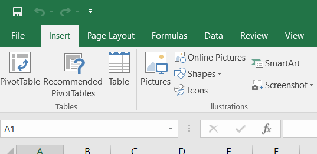

Each tab comes with features (buttons, checkboxes, ...). For the `Insert` tab, we've first a group of three buttons into a group called `Tables`:

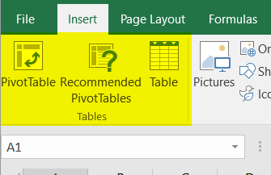

So, a ribbon should be:

1. Defined in a tab (his own tab or an existing one)
2. Add features in one or more groups (own groups or existing ones)

Below, our manifest now, with the definition of the ribbon. *Lines starting with a `+` are the ones we've added. The `+` sign is here only to put in evidence the lines; the sign is not valid so don't copy/paste in your ribbon.*

```diff
<customUI xmlns="http://schemas.microsoft.com/office/2009/07/customui">
+    <ribbon>
+        <tabs>
+             <tab id="customTab" insertAfterMso="TabView" label="Tab">
+                <group id="customGroup" label="Group">
+                    YOUR FEATURES HERE
+                </group>
+        </tabs>
+    </ribbon>
</customUI>
```

#### Define the tab

You'll need to give an identifier to the tab (in the attribute called `id`): your own code for a new tab or the id of an existing tab.

The standard name are:

* `TabHome`
* `TabInsert`
* `TabPageLayoutExcel`
* `TabFormulas`
* `TabData`
* `TabReview`
* `TabView`
* `TabDeveloper`

So, if you want to add a button to the Home tab, just use `TabHome` as value for the `id`, f.i.,

```xml
<customUI xmlns="http://schemas.microsoft.com/office/2009/07/customui">
    <ribbon>
        <tabs>
             <tab id="TabHome">
                ADD A BUTTON TO TabHome
        </tabs>
    </ribbon>
</customUI>
```

The XML below will, in one line,

1. Create a new tab since the id `customTab` is not an existing id,
2. Put the new tab after the existing `View` tab (use `insertBeforeMso` to add the tab before),
3. And give him `Tab` as caption.

```xml
<tab id="customTab" insertAfterMso="TabView" label="Tab">
```

Here is our added tab:

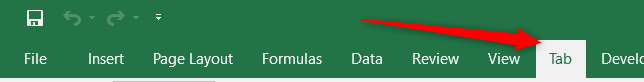

##### Define the ribbon

Inside the `<tab>` declaration, you need to define at least one `<group>`. And here too, you'll to define the identifier: an existing one for, f.i., adding a button in an existing group or a new one to create a new group.

The XML below will:

1. Create a new group since the id is a new one (`customGroup`),
2. And give him `Group` as name.

```xml
<group id="customGroup" label="Group">
```

Our tab with his group:

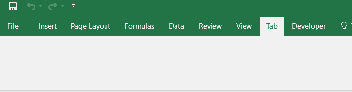

As you can see here above, just adding a group isn't enough, you'll need to define which features (buttons, checkboxes, ...) should be added in the group.

#### Add features

The XML here below will add to things: a button and an edit box.

*Lines starting with a `+` are the ones we've added. The `+` sign is here only to put in evidence the lines; the sign is not valid so don't copy/paste in your ribbon.*

```diff
<customUI xmlns="http://schemas.microsoft.com/office/2009/07/customui">
    <ribbon>
        <tabs>
             <tab id="customTab" insertAfterMso="TabView" label="Tab">
                <group id="customGroup" label="Group">
+                    <button
+                        id="customButton"
+                        label="Button"
+                        imageMso="HappyFace"
+                        size="large"
+                        onAction="OnButtonClicked" />
+                    <editBox
+                        id="customEditBox"
+                        label="Edit Box"
+                        onChange="OnEditBoxTextChanged" />
                </group>
        </tabs>
    </ribbon>
</customUI>
```

The XML below will create a button

1. With an `id` initialized to `customButton`,
2. His label (the text that is displayed under the button) set to `Button`,
3. Use the `HappyFace` standard image (`imageMso` is, indeed, the way to reuse a standard image while `image` allows you to define yours owns),
4. The size of the button will be `large` (a big button),
5. The action assigned will be the VBA function called `OnButtonClicked`.

```xml
<button
    id="customButton"
    label="Button"
    imageMso="HappyFace"
    size="large"
    onAction="OnButtonClicked" />
```

This will result into this:

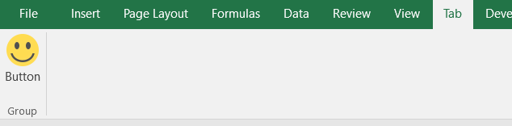

`OnButtonClicked` is the VBA callback: to make it work, add a module in your Excel file, create a subroutine like this:

```vbnet
Public Sub OnButtonClicked
    Msgbox "You've clicked on the button", vbInformation
End Sub
```

And we can add other features, like an edit box:

```xml
<editBox
    id="customEditBox"
    label="Edit Box"
    onChange="OnEditBoxTextChanged" />
```

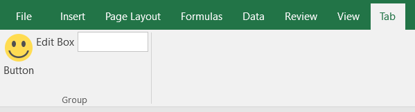

As you can see here above, the list of properties depends on the type: for a button, we've a `onAction` attribute while it's an `onChange` for an editBox.

<!-- below, content of ./030-edit-ribbon/readme.md -->

## Edit a ribbon

The best way to edit a ribbon is, for sure, to use CustomOfficeUIEditor but, for instance, if you don't have the tool installed on your computer but well 7-Zip, you can edit the ribbon with 7-Zip!

The MS Office file format is, in fact, an archive. Just rename the file's extension from `.xlsx` to `.zip` if you want to verify this assertion.

So, you can start the 7-Zip interface and open a .xlsx file where a ribbon has been created.

You'll see a folder called `customUI` and, there, a file called `customUI14.xml` (remember, that was the name of our inserted ribbon). By editing that .xml file within 7-Zip (a text editor will be opened), you can see the content and update it. By saving the file from within the editor, 7-Zip will compress it and add the file to the original MS Office file.

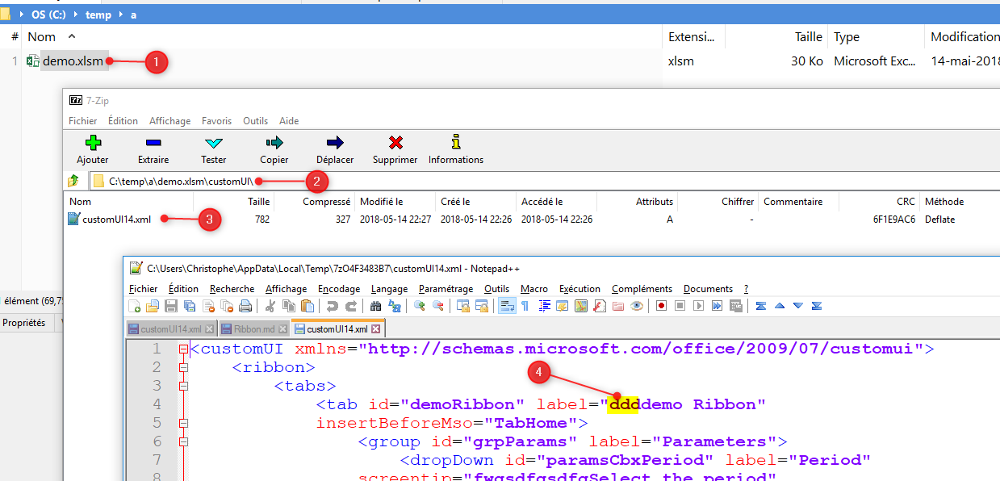

<!-- below, content of ./040-list-objects/readme.md -->

## List of objects

As exhaustively defined in the [ribbon's namespace](#namespace), here is the list of valid objects:

* `box`,
* `button`,
* `buttonGroup`,
* `checkBox`,
* `control`,
* `comboBox`,
* `dropDown`,
* `dynamicMenu`,
* `editBox`,
* `gallery`,
* `labelControl`,
* `menu`,
* `splitButton` and
* `toggleButton`

**Be careful**: XML is case sensitive, `editBox` is the only valid syntax, `editbox` or `EditBox` aren't.

Each object comes with this own attributes, some are mandatory while the others are optional.

<!-- below, content of ./050-find-images/readme.md -->

## Find images

By adding a button f.i., you'll assign an image to it.

You can use a personal image like the logo of BOSA (in that case, you'll need to import the image in the CustomOfficeUIEditor application and use the `image` attribute).

You'll most probably use an existing, standard, image. This can be done by using the `imageMso` attribute and telling Office which image to use; f.i.  `AddFolderToFavorites`:

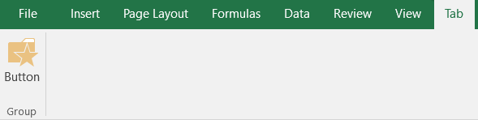

The manifest is this one:

```xml
<customUI xmlns="http://schemas.microsoft.com/office/2009/07/customui">
    <ribbon>
        <tabs>
            <tab idMso="TabHome" visible="false" />
             <tab id="customTab" insertAfterMso="TabView" label="Tab">
                <group id="customGroup" label="Group">
                    <button
                        id="customButton"
                        label="Button"
                        imageMso="AddFolderToFavorites"
                        size="large"
                        onAction="OnButtonClicked" />
                </group>
            </tab>
        </tabs>
    </ribbon>
</customUI>
```

But ... **how to retrieve the list of images?**

Microsoft maintains Excel files with the list of existing IDs that can be used as icons in our ribbon. The "Office 2010 Help Files: Office Fluent User Interface Control Identifiers" can be downloaded [here](https://www.microsoft.com/en-us/download/confirmation.aspx?id=6627). You'll get a lot of Excel files, on file by application (Access, Excel, Outlook, ...).

This will give the list of existing IDs in plain text but you'll not see the associated images.

You can download all images (as PNG) for MS Office 2010 or 2013 [here](http://hintdesk.com/2011/07/22/c-print-all-ms-office-imagemso-to-files) (see links in Chapter 2 Download).

An offline version for Office 2010 is [here](./files/Office_2010_Icon_Gallery_Files.zip) and [here](./files/Office_2013_Icon_Gallery_Files.zip) for Office 2013.

<!-- below, content of ./060-callbacks/readme.md -->

## Assign callbacks

This term means: which code (VBA in this case) should be fired when an event is raised.

When the user clicks on a button of the ribbon which subroutine should be called?

The XML code below assign the `OnButtonClicked` subroutine to the `onAction` event of the button.

```xml
<button
    id="customButton"
    label="Button"
    imageMso="AddFolderToFavorites"
    size="large"
    onAction="OnButtonClicked" />
```

So, if we wish to catch that event, we'll need to add a public subroutine in our Excel file, that subroutine can be placed in any module, should be public and should have `OnButtonClicked` as name.

But... depending on the callbacks (click, change, toggle state, change, ...), the definition of the subroutine is not the same.

For a button, the VBA should be something like:

```vbnet
Public Sub OnButtonClicked(control As IRibbonControl)
    ' YOUR CODE
End Sub
```

For an edit box and the `onChange` event, the callback is different:

```xml
<editBox
    id="customEditBox"
    label="Edit Box"
    onChange="OnEditBoxTextChanged" />
```

```vbnet
Public Sub OnEditBoxTextChanged(control As IRibbonControl, sText As String)
    ' YOUR CODE
End Sub
```

The declaration of callbacks can be found on the official site :
[How can I determine the correct signatures for each callback procedure?](
https://docs.microsoft.com/en-us/previous-versions/office/developer/office-2007/aa722523(v=office.12)#how-can-i-determine-the-correct-signatures-for-each-callback-procedure). Pay attention to the `Signatures` columns; you need to look for `VBA`.
